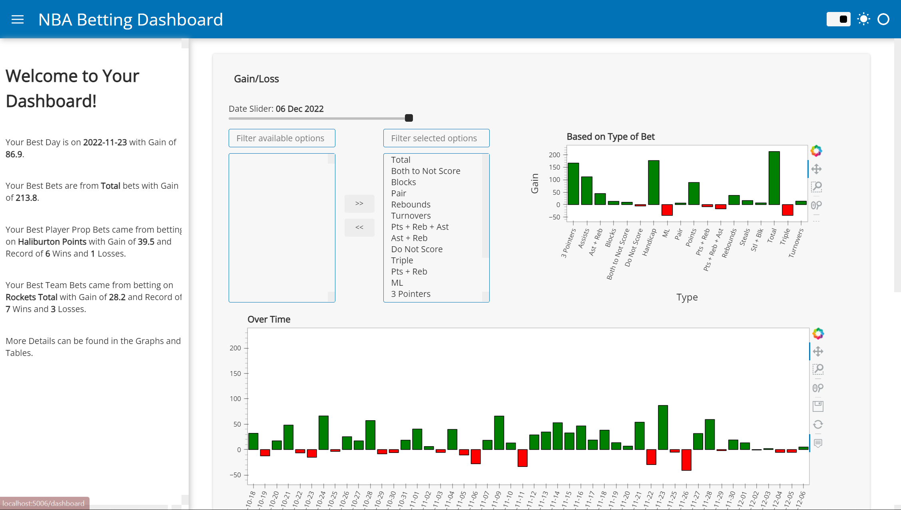
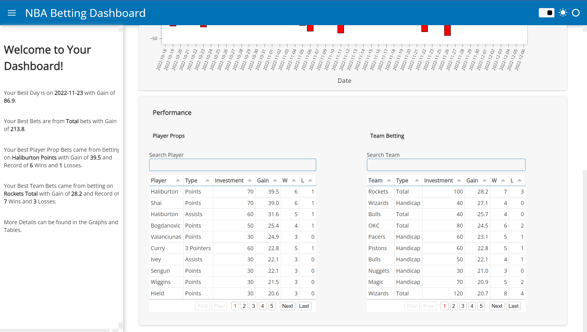

# Betting Dashboard
- Created a dashboard displaying interactive graphs and tables on user performance.
- Processed and engineered features on the dataset.
- Used different widgets from the Panel package to optimise user experience.
- Hosted dashboard on local server.

## Code and Resources Used
**Python Version**: 3.8.8\
**Packages**: pandas, panel, hvplot, datetime\
**Web Framework Requirements**: ```pip install -r requirements.txt```\
**Dataset**: https://www.kaggle.com/datasets/maurylukas/sports

## Data Cleaning
Cleaning was required for data to be useable in the dashboard. The following was done:\
- Filtered for NBA bets.
- Translate columns and type of bets into English.
- Grouped similar types of bets.
- Changed Date column into datetime datatype.
- Created new columns for gain of each bet, rolling profit and rolling win rate.

## Dashboard
To serve the dashboard locally, use the following command: ```panel serve dashboard.ipynb```



